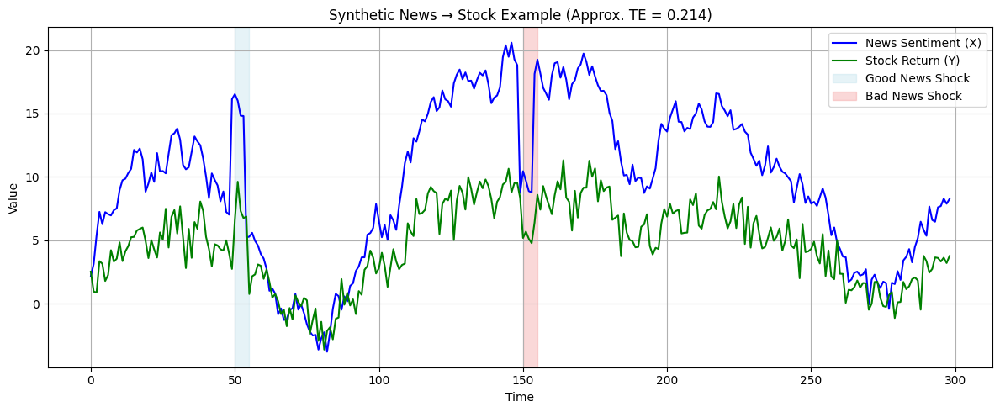

Gamma Link: https://gamma.app/docs/Bayer-7cpw0m4nar8fbgj?mode=doc


# 贝叶斯推断

>贝叶斯推断在数字普惠金融中通过动态学习机制持续优化模型，能够有效利用少量数据并结合先验知识（如行业经验或区域特征）降低服务门槛，同时以概率量化风险（如违约可能性）增强决策透明度，其灵活性可处理经济波动、地域差异等复杂场景变量，并通过清晰展示关键影响因素（如收入稳定性、信用历史）提升模型可解释性，尤其适用于数据匮乏的农村或小微企业信贷场景，在保障金融安全的同时实现精准服务覆盖。


> [!example] 举个例子 
> 假设某银行需评估一位种植水稻的农民信用风险，初始根据当地农业贷款经验（先验知识）设定其违约概率为 15%。进一步收集数据：该农民拥有 5 亩农田、种植高抗旱品种且过去两年按时还款。贝叶斯模型将这些新信息与先验结合，通过概率计算动态调整违约概率至 8%，并量化天气干旱（影响收成）、粮食价格波动等不确定因素对结果的具体影响权重。银行可据此灵活设定贷款额度或利率，既解决农村地区历史数据不足的问题，又以透明的概率评估（如 “当前违约风险 8%”）和关键因素解释（如 “干旱导致风险增加 3%”）提升决策可信度，实现精准风险管控。

| Name    | Age | City      |
| ------- | --- | --------- |
| Alice   | 24  | New York  |
| Bob     | 30  | San Diego |
| Charlie | 28  | Chicago   |

| Task         | Status    | Priority |     |
| ------------ | --------- | -------- | --- |
| Write report | ✅ Done    | 🔴 High  |     |
| Review notes | ⏳ In Prog | 🟡 Med   |     |
| Plan agenda  | ⌛ Pending | 🔵 Low   |     |
|              |           |          |     |

| Name    | Role       | Status   |
|---------|------------|----------|
| Alice   | Researcher | ✅ Active |
| Bob     | Reviewer   | ❌ Left   |
| Carol   | Analyst    | ⏳ Pending|


```python
from math import log2
from matplotlib import pyplot

# calculate entropy

def entropy(events, ets=1e-15):
 return -sum([p * log2(p + ets) for p in events])

# define probabilities

probs = [0.0, 0.1, 0.2, 0.3, 0.4, 0.5]

# create probability distribution

dists = [[p, 1.0 - p] for p in probs]

# calculate entropy for each distribution

ents = [entropy(d) for d in dists]

# plot probability distribution vs entropy

pyplot.plot(probs, ents, marker='.')
pyplot.title('Probability Distribution vs Entropy')
pyplot.xticks(probs, [str(d) for d in dists])
pyplot.xlabel('Probability Distribution')
pyplot.ylabel('Entropy (bits)')
pyplot.show()
```


<figure>
  
  <figcaption>Figure 1: Entropy vs Probability Distribution</figcaption>
</figure>

## 🧐 **什么是贝叶斯推断** 


## 📅 生活中的贝叶斯


## 关于贝叶斯的几个重要部分


### 似然函数


### 先验概率

### 后验概率